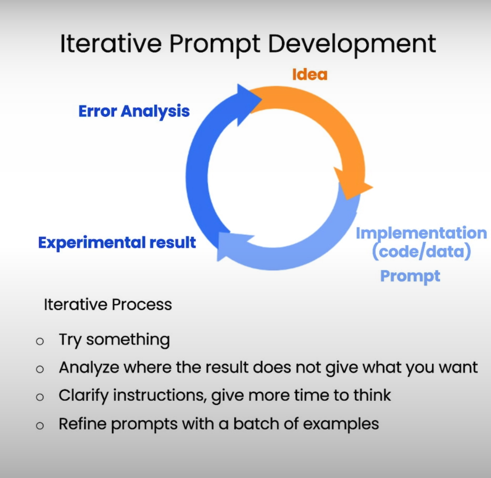
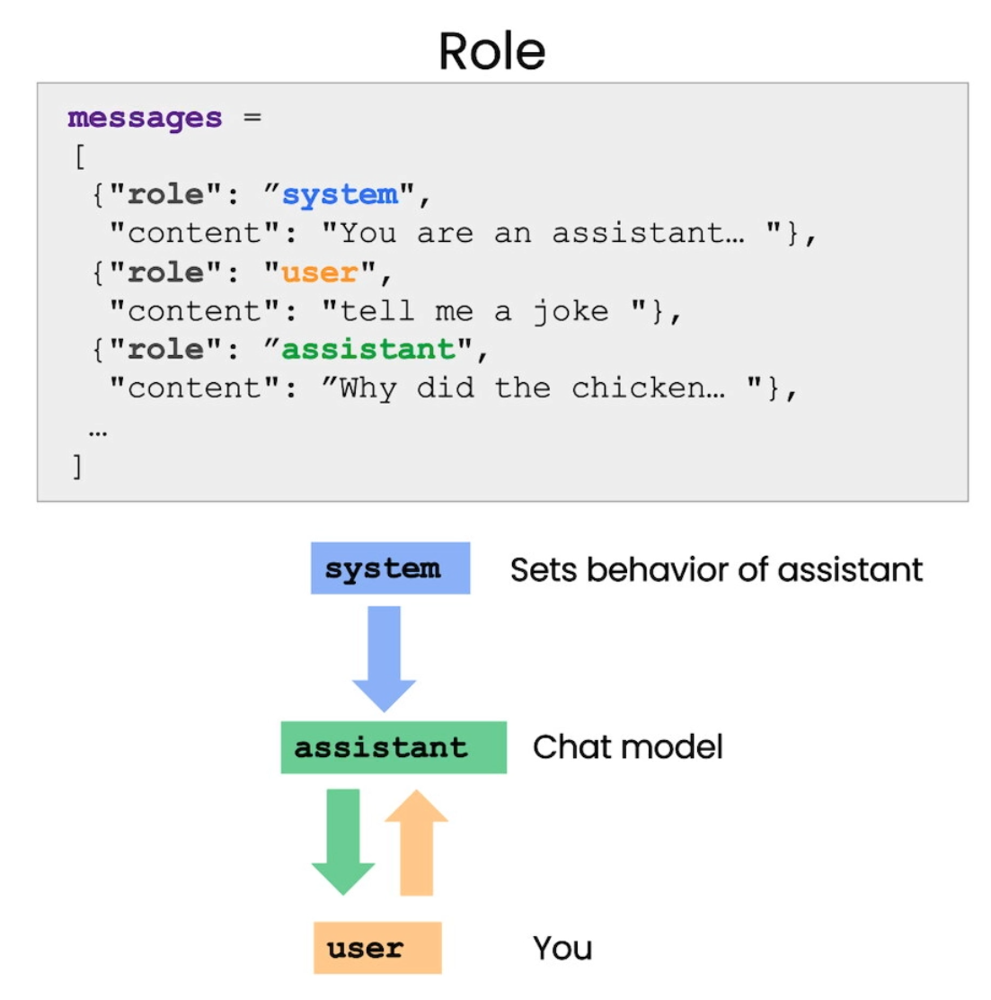

# Deep Learning ChatGPT Prompt Engineering for Developers

## L2 - Guidelines
### Principle 1: Write clear and specific instructions
clear does not mean short!

Tactic 1: Use delimiters to clearly indicate distinct parts of the input.
Delimiters can be anything like: ```, """, <>, <tag></tag>
This makes it hard for llm prompt injections! 

Tactic 2: Ask for a structured output
I.E. JSON, HTML

Tactic 3: Check whether conditions are satisfied.
Check assumptions required to do the task. Considerations for edge cases too for unexpected results or errors. 

Tactic 4: Few-shot prompting
Give successful examples of completing tasks. Then ask model to perform the task. 

### Principle 2: Give the model time to "think"
Make a chain of reasoning before it provides its answer. It may make an assumptions and lead to the wrong answer. 
Tactic 1: Specify the steps required to complete a task
(This approach example has a good transition to idea of langchaining)

Tactic 2: Instruct the model to work out its own solution before rushing to a conclusion.

Model Limitations: Hallucinations (Make statements that sound plausible but are not true)
Possible solution is to First find relevant information, then answer the question based on the relevant information.

## L3 - Iterative 
- Unlike to get at production prompt at the beginning. 
ML Iterative prompt Development
... -> Idea -> Implementation(code/data) -> Experimental results -> Error Analysis -> Repeat...
Prompting
... -> Idea -> Implementation(code/data) prompt -> Experimental results -> Error Analysis -> Repeat...

Prompt guidelines:
- Be clear and specific
- Analyse why result does not give desired output (What is the issue with the response?)
- Refine the idea and the prompt
- Repeat



Having good processes to development is the best way to develop prompts.
For early application, having a single prompt developed over time, for mature application, a framework that could batch test against different examples.

## L4 - Summarising
Summarising with different focuses.

## L5 - Inferring
Comparatively to traditional ML, requiring multiple models, Gen AI inference only requires one model. 
Example: Given a product review text, extract sentiment(+/-) with a long sentence or single word, Identify types of emotions.
It can be used to extract price information such as product and company name from customer reviews. Multiple extraction tasks can be simultaneously. 
Inferring topics or multiple topics?
Make a news alert for certain topics? Zero-shot learning. 

## L6 - Transforming
Language translation. Recognising and translating. 
Tone transformation. I.E. informal, formal
Format conversion. I.E. json to list 
Spellcheck/Grammar check. Proofreading, correct the text and/or rewrite for the correct version. If no errors, provide a "No error found".

## L7 - Expanding
learning to modify the temperature. 
For tasks that require reliability, predictability. Using temp 0. 

## L8 - Chat(bot) Workflow

LLM predicting the next prediction.
for conversation, higher temperature is suitable but when it's tasks, lower the better.
